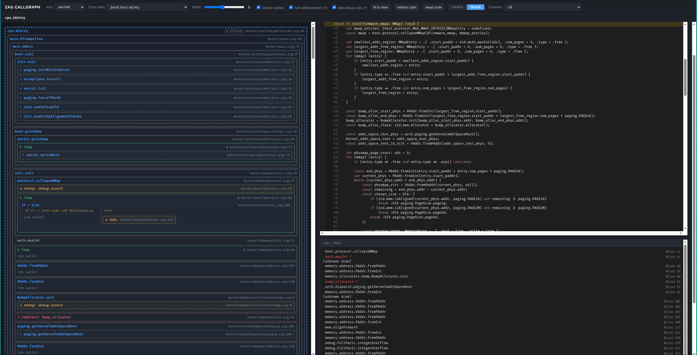

# Zag

A capability-based microkernel written in Zig, currently mid-rebuild against [spec v3](docs/kernel/specv3.md). The new kernel surface is implemented and the test runner is on its second generation; many tests do not yet pass.

## Status

Spec v3 is a ground-up redesign — the syscall ABI, capability model, IPC, scheduler primitives, address-space layout, and test runner all changed. Code, runner, and most syscalls are in place; gaps are being closed test-by-test against the spec checklist at [`tests/tests/CHECKLIST.md`](tests/tests/CHECKLIST.md).

## Architecture

The kernel exposes a small set of typed capability objects. Userspace gets things done by holding handles to them and invoking syscalls.

| Object | Role |
|---|---|
| **Capability Domain** | Process-equivalent. Owns a handle table and the static caps that gate every syscall. |
| **Execution Context** | Thread-equivalent. Runnable, suspendable, attachable to vregs for IPC. |
| **Var** (Virtual Address Range) | Mapped region in a domain's address space. Backed by page frames or device regions. |
| **Page Frame** | Contiguous physical memory, allocated and revocable. |
| **Device Region** | MMIO/port-IO range gated by a capability. |
| **Virtual Machine** | KVM-style guest container; vCPUs are ECs in a VM domain. |
| **Port** | IPC endpoint. ECs suspend on it; senders deliver vreg payloads. |
| **Event Route** | Kernel-event → port routing (faults, timers, exits). |
| **Reply** | One-shot capability minted on suspension; resolves a waiting EC. |
| **Timer** | Programmable one-shot/periodic wake on a port. |
| **Futex** | Address-keyed wait/wake on shared memory. |

Syscall ABI uses **128 virtual registers** (low ones backed by GPRs, the rest spill to the user stack), with an L4-style IPC fast path for suspend/reply. See [`docs/kernel/specv3.md`](docs/kernel/specv3.md) for the full spec.

## Repo layout

```
kernel/                Kernel proper
  arch/                  Arch dispatch + per-arch impls (x64, aarch64)
  boot/                  UEFI handoff
  capdom/                Capability domain, var range, virtual machine
  caps/                  Capability/handle types and derivation
  devices/               Device region registry
  memory/                PMM, VMM, page frames, paging, fault, allocators/
  sched/                 Scheduler, EC, futex, port, timer, perfmon, FPU
  syscall/               Per-object syscall handlers + dispatch
  kprof/                 In-kernel tracing/sampling profiler
  utils/                 Containers, sync primitives, ELF, debug info

bootloader/            UEFI bootloader (KASLR, kernel + root-service load)

tests/
  tests/                 Spec v3 test runner + 475 test ELFs
    runner/                primary.zig (in-kernel orchestrator) + serial
    tests/                 one ELF per spec assertion (e.g. recv_07.zig)
    build.zig              authoritative test manifest
    CHECKLIST.md           per-section progress tracker
    verify_coverage.py     enforces spec ↔ test parity
  prof/                  Kernel perf regression harness + baselines
  fuzzing/               Fuzzers (buddy allocator, vmm, …)
  redteam/               Red-team regression PoCs (being repopulated under v3)
  precommit.sh           Full local CI gauntlet (see below)
  test.sh                Day-to-day target dispatcher (kernel, perf, fuzz)
  ci.sh                  Long-form CI script with timestamped run logs

tools/                 Dev tooling (see Tools)

docs/
  kernel/                specv3.md (observable behavior), systems.md (internals)
  x86/                   Intel SDM / VMX / VT-d / AMD SVM / AMD-Vi PDFs
  aarch64/               ARM ARM, GICv3, SMMUv3, PSCI, IORT, PL011 PDFs
  devices/               NVMe, xHCI, virtio, x550 datasheets
  tools/                 Tool docs + screenshots
```

## Test runner architecture

The kernel test suite runs entirely in-kernel — no host shell harness loops over QEMU boots. One QEMU boot runs all 475 tests in parallel.

- The **primary** (root service, `tests/tests/runner/primary.zig`) owns all rights and drives the suite.
- It mints a single **result port** and spawns each test as its own child capability domain, passing the port handle with `bind | xfer` caps.
- Each test ELF is embedded into the primary at build time (`tests/tests/build.zig` is the manifest). Each test asserts spec behavior, then calls `libz.testing.report`, which suspends the initial EC on the result port with vregs encoding `{result_code, assertion_id, tag}`.
- The kernel scheduler/SMP gives parallelism for free. The primary `recv`s suspension events and writes them into a tag-indexed table; the tag is the manifest index, so result join is order-independent.
- A final pass over the manifest joins names with results and prints pass/fail per test plus a summary line.

Test discovery is build-time: add an ELF under `tests/tests/tests/<slug>_NN.zig`, append an entry to `test_entries` in `tests/tests/build.zig`, and the runner picks it up.

## Building

```bash
zig build -Dprofile=test           # build kernel + test suite
zig build run -Dprofile=test       # boot under QEMU/KVM, run the suite
```

Cross-arch:
```bash
zig build -Darch=arm -Dprofile=test
```

## Tools

All under [`tools/`](tools/). Each builds with `zig build` from its own directory.

### callgraph — interactive call graph explorer

[`tools/callgraph/`](tools/callgraph/) — parses kernel LLVM IR + Zig AST and serves a browser UI for navigating the call graph. Same daemon also runs as an MCP server over stdio for use from agentic tools.



```bash
cd tools/callgraph && zig build
./zig-out/bin/callgraph                 # http://127.0.0.1:8080
./zig-out/bin/callgraph --mcp           # stdio MCP server
./zig-out/bin/callgraph --verify        # AST/IR diff, exit
```

### check_gen_lock — SecureSlab gen-lock analyzer

[`tools/check_gen_lock/`](tools/check_gen_lock/) — token-based static analyzer that enforces the kernel's generational-lock invariant: every pointer to a slab-backed object (Process, Thread, Vm, VCpu, …) is stored as `SlabRef(T)` and every dereference goes through a `lock()`/`unlock()` bracket. Gating stage in precommit.

### dead_code_zig — dead-code detector

[`tools/dead_code_zig/`](tools/dead_code_zig/) — `std.zig.Tokenizer`-based dead-code finder. Comment- and string-aware, alias-chain aware (`pub const X = mod.X;` re-exports are caught when nothing consumes them). Hash-validated skip file at `kernel/.dead-code-skip.txt` whitelists hardware-spec layouts.

### bin_analyzer — ELF source ↔ disassembly explorer

[`tools/bin_analyzer/`](tools/bin_analyzer/) — split-pane analyzer that uses DWARF debug info to map between source lines and disassembly bidirectionally. CLI mode for scripting; see [`docs/tools/bin_analyzer.md`](docs/tools/bin_analyzer.md).

## Local CI — `tests/precommit.sh`

Runs the full cross-arch gauntlet before commits. Stages run independently and failures are summarized at the end:

| Stage | Gate |
|---|---|
| arch layering lint | `zag.arch.dispatch` not used inside `kernel/arch/<arch>/`; generic code never reaches into `zag.arch.x64`/`aarch64` (must go through dispatch). |
| dead-code detector | `tools/dead_code_zig` exits non-zero on any unwhitelisted finding. |
| gen-lock analyzer | `tools/check_gen_lock` exits non-zero on any err-severity finding. |
| x86-64 kernel tests | Full suite under local KVM. |
| aarch64 kernel tests | Same suite, run on a Pi 5 over SSH (`PI_HOST` overridable). |
| boots Linux guest (x86-64) | KVM, must reach the guest shell within 90s. |
| boots Linux guest (aarch64) | Local TCG, must reach the guest shell within 300s. |
| red-team regressions | `tests/redteam/run_all.sh` — every PoC must emit `POC-<id>: PATCHED`. |
| kernel perf gate | `tests/prof/run_perf.sh --compare-baseline` — kprof per-scope medians vs baselines. |

```bash
PARALLEL=8 ./tests/precommit.sh
```

Knobs: `PARALLEL`, `PI_HOST`, `PI_LIMIT`, `PI_TIMEOUT`.

## Documentation

- [`docs/kernel/specv3.md`](docs/kernel/specv3.md) — observable behavior from userspace (syscalls, capabilities, error codes, limits). The **what**.
- [`docs/kernel/systems.md`](docs/kernel/systems.md) — internal implementation (algorithms, data structures, boot sequence). The **how**.
- [`docs/x86/`](docs/x86/), [`docs/aarch64/`](docs/aarch64/), [`docs/devices/`](docs/devices/) — vendor reference PDFs cited from kernel hardware code.
- [`docs/tools/`](docs/tools/) — tool docs and UI screenshots.
